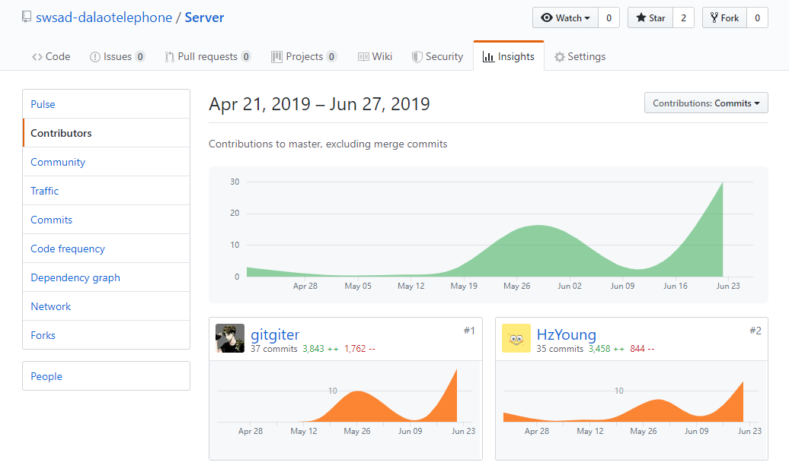
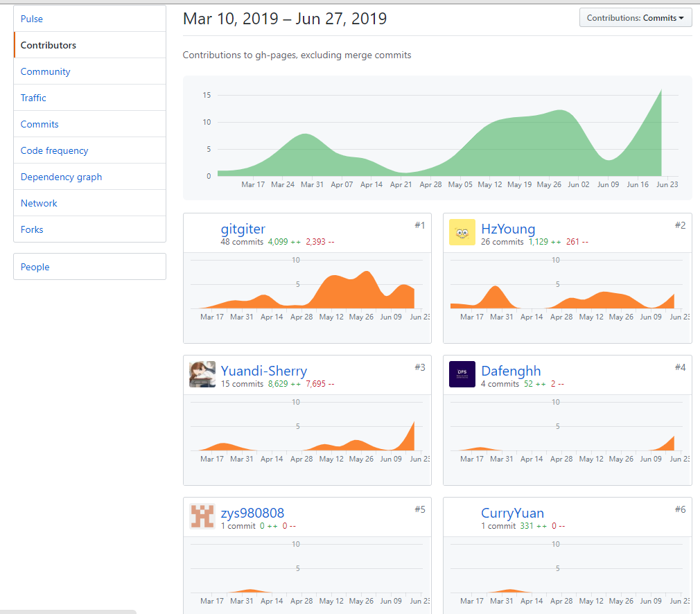

## 小组分工与贡献率

|学号|昵称（姓名）|Github|分工内容|贡献率|
|:--:|:--:|:--:|:--:|:--:|
|16340269|Young（杨泓臻）|[HzYoung](https://github.com/HzYoung)|项目开发进度的管理，需求分析相关文档，数据库设计，搭建后端go开发框架，后端开发，后端测试|19%|
|16340306|Jeff（郑宇森）|[zys980808](https://github.com/zys980808)|小程序前端开发，前端测试|15%|
|16340311|Sherry（周远笛）|[Yuandi-Sherry](https://github.com/Yuandi-Sherry)|客户调研，UI设计，小程序前端开发|15%|
|16340255|gitgiter（谢涛）|[gitgiter](https://github.com/gitgiter)|架构设计，api接口设计，后端开发，后端测试|18%|
|16340260|Dafeng（徐达烽）|[Dafenghh](https://github.com/Dafenghh)|小程序前端开发，前端测试|15%|
|16340282|CurryYuan（袁之浩）|[CurryYuan](https://github.com/CurryYuan)|小程序前端开发，前端架构设计，前端测试|18%|

## 项目所有贡献图表截图
- 小程序源码贡献

- 服务端源码贡献

- 文档制品贡献

## 制品与贡献率

| 制品       | Young（杨泓臻） | Jeff（郑宇森） | Sherry（周远笛） |gitgiter（谢涛） | Dafeng（徐达烽| CurryYuan（袁之浩） |
| ---------- | ---- | ------ | ------ | ------ | ------ | ------ |
| 后端源代码  | 50% |    |   |  50%  |   |    |
| 小程序源代码  |   |  25%  |  10% |   | 35%  |  30%  |
| UI设计   |   |     | 100%   |  |    |   |
| 前期调研   | 16%  |  16%    | 20%    |  16%     | 16%    | 16%    |
| 需求规格 | 60%  |  | 40%  |   |     |    |
| 软件设计 |  20% |  | | 60%|   | 20%|
| 测试 | 20% | 20% |   | 20% | 20% | 20%|
| 其他 | 10% | 20% | 20% | 10% | 20%| 20%|
