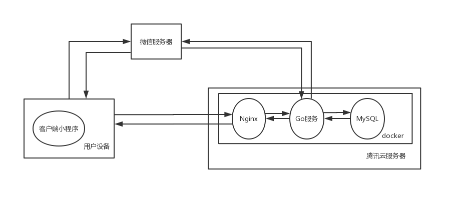
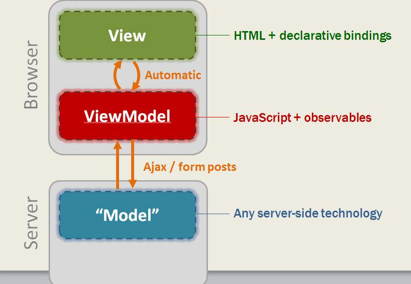

# 软件设计文档 (SD)

---

## 0. 项目综述

本项目旨在提供一个平台供校内师生发布和接受众包任务。

为实现此需求，本项目需采取 **C/S架构**设计，分别实现客户端程序和服务端程序。并为进一步提升开发的并行性和效率，遵循 “低耦合，高内聚” 的原则，采取了**前后端分离**的应用架构和开发模式。

项目使用**小程序**作为客户端程序（即前端）的实现载体，基于**GoLang**实现服务端程序（即后端），在前后端的交互上遵循**RESTful原则**

以下是项目架构图：



## 1. Client

### 1.1 技术选型

本项目选用了微信小程序原生框架作为前端开发框架，理由如下：

- 小程序开发比较类似于web，在具备一定的web开发基础下上手简单
- ​网页开发渲染线程和脚本线程是互斥的，长时间的脚本运行可能会导致页面失去响应。而在小程序中，二者是分开的，分别运行在不同的线程中
- 框架管理了各个页面完整的生命周期，并提供了完善的路由管理和双向数据绑定的功能，在开发上提供了较大的便利性
- 小程序自研了基于 `HTML` 的标记语言 `WXML`，对各种常用组件、事件、数据绑定、渲染等功能进行了一层封装，在使用上更为便利
- 小程序主要开发语言为`JavaScript`， 并支持ES6特性， 在开发上带来了一定的便利性。 
- 小程序使用自研的`WXSS`作为样式标记语言，并规定了新的像素尺寸 `rpx`(responsive pixel)，可以根据屏幕宽度进行自适应，其屏幕宽统一为50rpx
- 小程序提供了一套便利的**接口**，可以使用这些接口便捷地调用微信用户信息、音视频、地图、本地存储功能等
- 对于用户来说，小程序以微信作为接入口，更贴合广大校园互联网用户的使用习惯，降低了用户的使用门槛

### 1.2 程序架构

#### Life cycle - 页面生命周期

正如在技术选型理由所说的，小程序的开发渲染线程(View Thread)和脚本线程(AppService Thread)是并行的，而某个页面具体的生命周期如下图所示：


在本项目中，冷数据的数据加载尽量使用页面导航时候的数据传递，导航着陆页通过 `OnLoad` 的参数接收，热数据的数据加载放到了 `OnShow` 中，这样即降低了请求量，又保证一些需要及时同步的数据能够及时得到同步。

**项目实际代码展示：**

- 冷数据通过导航传递
    ```js
    /**************** 数据源页 ***************/
    wx.navigateTo({
        url: '/pages/auditlist/auditlist?id=' + e.currentTarget.dataset.item.id
    })
    /**************** 跳转页 ***************/
    onLoad: function (options) {
        let task_id = '';
        if (typeof options.id != 'undefined') {
            task_id = options.id;
        }
        //...省略的代码
    }
    ```
- 热数据向后端请求
    ```js
    onShow: function () {
		let task_id = this.data.task_id
        http._get("/task/" + task_id)
            .then(res => {
                let taskInfo = JSON.parse(res.task)
                this.setData({
                    taskInfo: taskInfo
                })
                this.renderTask(taskInfo)
            })
            .catch(...)
            ...
    }
    ```

#### API & session - 微信接口服务交互模型 & 项目session机制

在小程序的开发中，许多小程序的接口调用基于安全考虑是需要小程序客户端（用户的手机）、后端服务器、微信小程序服务器三者配合实现。常见的功能比如微信登陆、微信支付都有类似这样的调用流程，下面就项目中应用到的**微信登陆**对这一流程进行阐述。


**基于本项目的需求，我们对上图中的流程进行了一定程度的修改和丰富。**

- 客户端调用`wx.login`从微信服务器获取一个临时code，并发送给后端服务器，由后端服务器请求微信服务器获得每个用户独立的open_id
- session机制采用了web开发中最为流行的`Cookie机制`，后端在获取到open_id后即在向客户端的response中带上`Set-Cookie`指令
- 客户端在cookie生命周期内，在request header中携带该cookie

### 1.3 模块划分

前端的模块划分参见文件结构。

```bash
Client
├─components    # 组件
├─pages         # 页面
│  ├─index      # 每个页面都由四个文件组成
│  │   ├─index.json
│  │   ├─index.wxml
│  │   ├─index.wxss
│  │   └─index.js
│  ├─login
│  │   ├─login.json
│  │   ├─login.wxml
│  │   ├─login.wxss
│  │   └─login.js
│  └─ ...       # 更多页面
├─app.json      # 总配置文件
├─app.wxss      # 公共样式
└─app.js        # 小程序公共js文件
```

### 1.4 软件设计技术

#### MVVM架构

在以往的Web开发中（比如使用jQuery进行开发），程序通常会通过 JavaScript 操作 DOM (对应 HTML 的描述产生的树)，以引起界面的一些变化响应用户的行为。例如，用户点击某个按钮的时候，js会记录一些状态到变量里边，同时通过 DOM API 操控 DOM 的属性或者行为，进而引起界面一些变化。

当项目越来越大的时候，代码会充斥着非常多的界面交互逻辑和程序的各种状态变量，显然这不是一个很好的开发模式，因此就有了 `MVVM` (View <--> View Model <--> Model) 的开发模式，提倡把渲染和逻辑分离。现在比较流行的前端开发框架例如 React 和 Vue都是采取这样的模式（当然值得一提的是，之前UWP课程也是这种模式）。小程序的原生框架也采取了MVVM的设计模式。

**`MVVM`，简单来说就是不要再让 JS 直接操控 DOM，JS 只需要管理状态即可，然后再通过一种模板语法来描述状态和界面结构的关系即可。**



**具体项目代码展示:**

`WXML`文件:
```html
<view class="taskList" wx:for="{{taskList}}" wx:key="{{item.id}}">
    <my-card bindtap="openReceive" data-item="{{item}}" item="{{item}}" thumb="https://i.loli.net/2017/08/21/599a521472424.jpg " show="0"></my-card>
</view>
```

`JavaScript`文件
```js
this.setData({
    taskList: tasks,
    taskList1: tasks1,
    taskList2: tasks2,
    taskList3: tasks3
})
```

#### 回调机制

微信小程序的许多操作都是采取`回调`的机制（比如网络请求、页面跳转），回调机制简单来说就是在执行某个异步操作的时候会给该异步操作**注册**一个函数，再在该操作返回结果的时候调用这个函数，以达到**异步调用**的效果。

小程序的一个标准的网络请求是这样的：
```js
wx.request({
    url: 'test.php',
    header: {
        'content-type': 'application/json' // 默认值
    },
    success: res => {
        console.log(res.data)
    },
    fail: res => {
        console.log(res)    
    }
})
```
这上面的 `success` 就是注册了一个匿名箭头函数(es6特性)，在网络请求返回成功的结果时输出日志；但如果我要在一个网络请求之后执行下一个网络请求，甚至**多个网络请求并行执行**的时候，不断地注册函数会导致函数体十分庞大，俗称 **回调地狱**

针对这一现象，我们使用 `Promise` 优化了 `wx.request`，并封装了项目需要的后端服务器地址、cookie机制等内容。 

**关键Promise封装代码**

```js
const http = ({
	url = '',
	param = {},
	content_type = 'application/json',
	...other
} = {}) => {
	wx.showLoading({
		title: '请求中，请耐心等待..'
	});
	return new Promise((resolve, reject) => {
		wx.request({
			url: getUrl(url),
			data: param,
			header: {
				'content-type': content_type,
				'cookie': wx.getStorageSync("baobaozhuan_cookie") || ''
			},
			...other,
			complete: (res) => {
				// 保存cookie
				if (res.header && res.header["Set-Cookie"]) {
					wx.setStorageSync("baobaozhuan_cookie", res.header["Set-Cookie"].split(';')[0])
				}
				wx.hideLoading();
				if (res.statusCode >= 200 && res.statusCode < 300) {
					resolve(res.data)
				} else {
					reject(res)
				}
			}
		})
	})
}
```

**具体请求代码展示**

```js
http._get("/user/profile")
    .then(res => {
        let userInfo = JSON.parse(res.user)
        console.log(userInfo)
        this.setData({
            userInfo: userInfo
        })
    })
    .catch(res => {
        // ...
    })
```

## 2. Server


### 2.1 技术选型理由

**后台主要技术栈是： Nginx + Go Gin + Redis + MySQL + Docker一键部署**， 理由如下：


**Nginx**：

- 后台需要一定的安全保障，Nginx作为反向代理可以将服务端跟外界隔离开。
- Nginx 可以为多个服务端进行代理，可以代理部署在多个端口 go server，从而使得服务器有着较高的抗压能力。
- Nginx 较为熟悉，学习成本较低，也较容易配置端口转发。
- Nginx 也被许多互联网公司部署产品时广泛采用。


**Go Gin**：

- Gin 是一个 go web 框架，最大的优点就是高性能，比 http router 快 40 倍。
- 轻量，使用起来方便简洁，支持路由分组。
- 对中间件支持很好，方便用第三方中间件也可以自己定义，还能很方便地跟路由进行结合。
- 学习成本低。


**Redis** ：

- 提供缓存支持，有利于提高数据交换速率。
- 保存cookie，记录用户状态，方便鉴权。


**MySQL**：

- 后端开发成员有一定的使用经验。
- 也是主流的数据库之一。


**Docker**:

- 自带环境，部署不依赖宿主机，和宿主机环境高度分离。
- 镜像管理方便。
- 部署简单，可轻易部署多个相同的服务端，结合 Nginx 提升抗压能力。
- 可扩展性高，业界主流。


### 2.2 架构设计

整体是经典的 **C/S** 架构，以下为部署架构图，其中后台的每个部分均进行了 docker 化，使用 docker-compose 一键部署可以极大地简化的部署流程。


通过 docker 多开几个 Web Server 的容器实例，分别监听在不同的端口，结合 Nginx 多端代理，可以很方便提高服务器的抗压能力、性能。

配置文件链接：

1. [docker-compose.yml](https://github.com/swsad-dalaotelephone/Server/blob/master/docker-compose.yml)
2. [Dockerfile](https://github.com/swsad-dalaotelephone/Server/blob/master/Dockerfile)
3. 注：这里只对 go server 进行了打包，其他均使用默认镜像源即可。

---

**其他架构设计问题：[Software Architecture Design](https://swsad-dalaotelephone.github.io/docs/SAD/)**

---

### 2.3 模块划分
后端的模块划分参见文件结构。

```bash
Server
├─config            # 读取并解析配置文件
├─controllers       # 路由处理函数
│  ├─ad
│  ├─resource
│  ├─task
│  └─user
├─database          # 数据库初始化
├─middlewares       # 中间件
│  ├─auth           # 鉴权
│  ├─cache
│  ├─logger
│  └─session
├─models            # 数据模型
│  ├─ad
│  ├─campus
│  ├─common
│  ├─school
│  ├─tag
│  ├─task
│  └─user
├─modules           # 功能模块
│  ├─gredis
│  ├─log
│  └─util
├─router            # 路由
└─storage           # 存储
    └─logs
    └─file
    └─img
```


### 2.4 软件设计技术

#### 2.4.1 Structure Programming

Go语言比较适合进行结构化编程，有很清晰的逻辑，尤其是结合了路由框架。

通过一个主文件 main.go 启动服务，再经过路由分发、路由处理、数据访问、持久化存储，层层衔接、环环相扣。


数据模型在 models 文件夹下定义，其中 test 是使用 go test 对数据模型进行测试，initXxx代表是初始化一些资源类的数据表。

详见下图：
```bash
models
─ad                         # 广告
│      ad.go
│
├─campus                    # 校区
│      campus.go
│      campus_test.go
│      initCampus.go
│
├─common
│      json.go
│
├─school                    # 学院
│      initSchool.go
│      school.go
│      school_test.go
│
├─tag                       # 标签
│      initTag.go
│      tag.go
│      tag_test.go
│
├─task
│      acceptance.go        # 接受记录
│      acceptance_test.go
│      dataCollection.go    # 数据收集
│      questionnaire.go     # 问卷
│      recruitment.go       # 招募
│      status.go
│      task.go              # 任务
│      task_test.go
│
└─user
        preference.go       # 偏好
        preference_test.go
        user.go             # 用户
        user_test.go
```

真正的数据模型有 ad、campus、school、tag、task、acceptance、dataCollection、questionnaire、recruitment、preference、user，每个数据模型都是一张表。


#### 2.4.2 Restful 服务架构

---

**详细请参见：[api设计](https://swsad-dalaotelephone.github.io/docs/api/)**

以及 [api规范](https://swsad-dalaotelephone.github.io/docs/%E5%90%8E%E7%AB%AF%E4%BB%A3%E7%A0%81%E8%A7%84%E8%8C%83.html#%E6%8E%A5%E5%8F%A3%E8%A7%84%E8%8C%83)

---

以下是所有路由处理函数：

```bash
controllers
├─ad
│      getRecommendAds.go
│
├─resource
│      getCampusById.go
│      getCampusList.go
│      getSchoolById.go
│      getSchoolList.go
│      getTagById.go
│      getTagList.go
│
├─task
│      acceptTask.go
│      downloadStatistics.go
│      getStatistics.go
│      getSubmittedTasks.go
│      getTaskDetail.go
│      publishTask.go
│      publishTask_test.go
│      quitTask.go
│      stopTask.go
│      submitTask.go
│      updateTask.go
│      verifyTask.go
│
└─user
        getAcceptedTasks.go
        getPreferencesById.go
        getProfile.go
        getPublishedTasks.go
        getRecommendTasks.go
        login.go
        logout.go
        modifyPassword.go
        register.go
        updatePreferences.go
        updateProfile.go
        weAppLogin.go
```


Go Gin 非常方便的路由分组分发以及中间件迭代。注：这里由于微信小程序不支持patch方法，将原patch方法改为put。

- Get：从服务端获取资源或资源列表。
- Post：创建一个新的资源。
- Put：完整地更新一个已有资源。
- Patch：部分地更新一个已有资源。
- Delete：删除一个资源。

```go
// user api
userGroup := router.Group("/user")
{
    userGroup.GET("/weApp", userController.WeAppLogin)
    userGroup.POST("", userController.Register)
    userGroup.POST("/session", userController.Login)
    userGroup.DELETE("/session", auth.AuthMiddleware(), userController.Logout)
    userGroup.GET("/profile", auth.AuthMiddleware(), userController.GetProfile)
    userGroup.PUT("/profile", auth.AuthMiddleware(), userController.UpdateProfile)
    userGroup.PUT("/password", auth.AuthMiddleware(), userController.ModifyPassword)
    userGroup.GET("/preferences", userController.GetPreferencesById)
    userGroup.PUT("/preferences", userController.UpdatePreferences)
    userGroup.GET("/recommendedTasks", userController.GetRecommendTasks)
    userGroup.GET("/publishedTasks", auth.AuthMiddleware(), userController.GetPublishedTasks)
    userGroup.GET("/acceptedTasks", auth.AuthMiddleware(), userController.GetAcceptedTasks)
}

// task api
taskGroup := router.Group("/task")
{
    taskGroup.POST("", auth.AuthMiddleware(), taskController.PublishTask)
    taskGroup.PUT("", auth.AuthMiddleware(), taskController.UpdateTask)
    taskGroup.GET("/:task_id", taskController.GetTaskDetail)
    taskGroup.GET("/:task_id/submittedTasks", auth.AuthMiddleware(), taskController.GetSubmittedTasks)
    taskGroup.PUT("/:task_id/status", auth.AuthMiddleware(), taskController.StopTask)
    taskGroup.GET("/:task_id/statistic", auth.AuthMiddleware(), taskController.GetStatistics)
    taskGroup.GET("/:task_id/statistic/downloadLink", auth.AuthMiddleware(), taskController.DownloadStatistics)
    taskGroup.POST("/:task_id/acceptance", auth.AuthMiddleware(), taskController.AcceptTask)
    taskGroup.DELETE("/:task_id/acceptance", auth.AuthMiddleware(), taskController.QuitTask)
    taskGroup.PUT("/:task_id/acceptance/answer", auth.AuthMiddleware(), taskController.SubmitTask)
    taskGroup.PUT("/:task_id/acceptance/result", auth.AuthMiddleware(), taskController.VerifyTask)
}

// ad api
adGroup := router.Group("/ad")
{
    adGroup.GET("/recommendedAds", adController.GetRecommendAds)
}

// resource api
resourcesGroup := router.Group("resource")
{
    resourcesGroup.GET("/school/:school_id", resourceController.GetSchoolById)
    resourcesGroup.GET("/campus/:campus_id", resourceController.GetCampusById)
    resourcesGroup.GET("/tag/:tag_id", resourceController.GetTagById)
    resourcesGroup.GET("/schools", resourceController.GetSchoolList)
    resourcesGroup.GET("/campuses", resourceController.GetCampusList)
    resourcesGroup.GET("/tags", resourceController.GetTagList)
}
```


#### 2.4.3 Nginx反向代理与负载均衡

**反向代理**
与正向代理不同，反向代理是为服务端进行代理，而不是为客户端代理。反向代理可以将真正的服务端跟外部网络、客户端隔离开来。长远发展还可以在反向代
理服务器与真正的服务器之间架设防火墙，防止外网对内网服务器的恶性攻击。


**负载均衡**
作为内容服务器（真正服务器）的替身，由于我们现在只有一台服务器，可以通过多个服务端来模拟多个服务器。可以缓存以减少服务器的压力，同时进行负载均衡，将用户请求分发给多个服务端（器）。


**Nginx配置**
[https://github.com/swsad-dalaotelephone/Nginx-conf](https://github.com/swsad-dalaotelephone/Nginx-conf)


#### 2.4.4 Service Oriented Architecture through Dockerize

> Service Oriented Architecture 将应用程序的不同功能单元（称为服务）进行拆分，并通过这些服务之间定义良好的接口和契约联系起来。

这个良好的接口和契约，可以通过 docker 来实现。docker 通过对不同粗粒度的服务，如 MySQL、Go Server、Nginx、Redis 等，分别进行容器化，便可通过网络对松散耦合的粗粒度应用组件进行分布式部署、组合和使用，从而满足服务复用、模块化、易用性、可扩展的需求。

**服务复用**
体现在 docker 可以创建多个相同作用的容器实例。

**模块化**
体现在各种粗粒度服务的可组合性。

**易用性**
体现在可以通过 docker 的配置文件如 docker-compose.yml 将所有的服务组合起来，实现一键部署。其次是可以让每个服务根据自己的 Dockerfile 创建和维护新的镜像。

**可扩展**
体现在只需简单修改 docker-compose.yml 便能改变服务依赖和部署结构，比如将 go server 换成 nodejs server，将 Nginx 换成 Apache，讲 MySQL 换成其他关系型数据库等。简单修改 Dockerfile 也可方便地对服务重新构建新的镜像。
